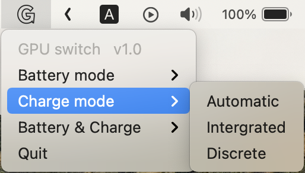

# GPU-switch
A tool to switch MacBook Pro graphics cards and working methods

**This program has not been tested for the time being. In theory, it can only work on an intel MacBook with a discrete graphics card inside ( 2016-2020 Macbook pro 15'/16').**

## How to use

After running the program, the program will only be displayed in the menu bar. Click the icon to adjust the working mode of the graphics card in battery mode or charging mode. The working mode of the graphics card is divided into automatic mode, integrated graphics only mode and discrete graphics only mode.

**NOTE: You can set the working modes of battery mode and charge mode separately, or set the working modes of battery mode and charge mode at the same time.**

## Installing

Please download the latest version in Releases page.

